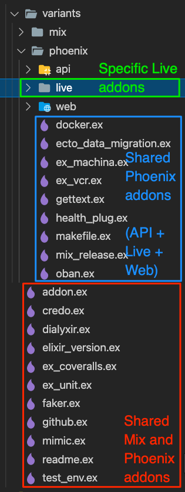

# Adding a new addon

There are 2 types of addon, Mix addon and Phoenix addon.

Phoenix addon consists of 3 types.
1. API
2. Live
3. Web



For example, to add a new web addon, create a new file at `lib/nimble_template/addons/variants/phoenix/web/sample_addon.ex`.

```elixir
defmodule NimbleTemplate.Addons.Phoenix.Web.SampleAddon do
  @moduledoc false

  use NimbleTemplate.Addons.Addon

  @impl true
  def do_apply!(%Project{} = project, opts) do
    project
  end
end
```

The module should implement `do_apply!` callbacks of a behaviour.

With a new corresponding test file at `test/nimble_template/addons/variants/phoenix/web/addon_test.exs`.

Then call `NimbleTemplate.Addons.Phoenix.Web.SampleAddon.apply!(project)` inside `lib/nimble_template/templates/variants/phoenix/web/template.ex` file which will be executed on Terminal prompt.

## Functions

These are functions from `NimbleTemplate.Generator` which can be called.

---

`copy_directory!(source_path, target_path, binding \\ [])`

Copy a directory and its content from source path to target path.

| Parameter | Type | Description |
| -- | -- | -- |
| source_path | String | Source path to copy the file from |
| target_path | String | Target path to copy the file to |
| binding | List | - |

Example
```elixir
Generator.copy_directory!("assets/nimble_js", "assets/js")
```

---

`copy_file!(files, binding \\ [])`

Copy a list of files from source path to target path.

| Parameter | Type | Description |
| -- | -- | -- |
| files | List | List of tuple containing format (`:text`, `:eex` or `:new_eex`), source path and target path |
| binding | List | - |

Example
```elixir
Generator.copy_file!([
  {:eex, "bin/start.sh.eex", "bin/start.sh"},
  {:text, "assets/bootstrap_css/vendor/_bootstrap.scss", "assets/css/vendor/_bootstrap.scss"}
])
```

---

`rename_file!(old_path, new_path)`

Rename a file from old path to new path.

| Parameter | Type | Description |
| -- | -- | -- |
| old_path | String | Old path to rename the file from |
| new_path | String | New path to rename the file to |

Example
```elixir
Generator.rename_file!("assets/css/app.css", "assets/css/app.scss")
```

---

`replace_content!(file_path, anchor, content)`

Find and replace specified content of an existing file.

| Parameter | Type | Description |
| -- | -- | -- |
| file_path | String | File path |
| anchor | String | Content to find |
| content | String | Content to replace |

Example
```elixir
Generator.replace_content!(
  "test/test_helper.exs",
  """
  ExUnit.start()
  """,
  """
  ExUnit.start(capture_log: true)
  """
)
```

---

`delete_content!(file_path, anchor)`

Find and remove specified content of an existing file.

| Parameter | Type | Description |
| -- | -- | -- |
| file_path | String | File path |
| anchor | String | Content to delete |

Example
```elixir
Generator.delete_content!(
  "assets/js/app.js",
  """
  // We import the CSS which is extracted to its own file by esbuild.
  // Remove this line if you add a your own CSS build pipeline (e.g postcss).
  import "../css/app.css"

  """
)
```

---

`inject_content!(file_path, anchor, content)`

Inject a specified content below a specified content of an existing file.

| Parameter | Type | Description |
| -- | -- | -- |
| file_path | String | File path |
| anchor | String | Content to find |
| content | String | Content to inject |

Example
```elixir
Generator.inject_content!(
  support_case_path,
  """
    use ExUnit.CaseTemplate
  """,
  """

    alias Ecto.Adapters.SQL.Sandbox
  """
)
```

---

`append_content!(file_path, content)`

Append a specified content to the end of an existing file.

| Parameter | Type | Description |
| -- | -- | -- |
| file_path | String | File path |
| content | String | Content to append |

Example
```elixir
Generator.append_content!(
  "assets/css/_variables.scss",
  """
  Content
  """
)
```

---

`inject_mix_dependency!(dependency)`

Inject a new mix dependency into `mix.exs` file.

| Parameter | Type | Description |
| -- | -- | -- |
| dependency | Tuple | Item of dependency |

`dependency` can also be a list of tuple in case of multiple items.

Example
```elixir
Generator.inject_mix_dependency!(
  {:credo, latest_package_version(:credo), only: [:dev, :test], runtime: false}
)
```

---

`make_directory!(path, touch_directory \\ true)`

Create a new directory.

| Parameter | Type | Description |
| -- | -- | -- |
| path | String | Path to create the new directory |
| touch_directory | Boolean | Create `.keep` file inside the directory |

Example
```elixir
Generator.make_directory!("assets/css/vendor/", false)
```

---

`create_file!(path, content)`

Create a new file with specified content.

| Parameter | Type | Description |
| -- | -- | -- |
| path | String | Path to create the new file |
| content | String | Content to put into |

Example
```elixir
Generator.create_file!(
  "assets/css/_variables.scss",
  """
  Content
  """
)
```

---

`print_log(prefix, content \\ "")`

Print log to console.

| Parameter | Type | Description |
| -- | -- | -- |
| prefix | String | Prefix of message to display |
| content | String | Content to display |

Example
```elixir
Generator.print_log("* applying ", inspect(__MODULE__))
```

---

# Run unit test on local

`mix test`

# Apply the whole template on local

See [[Generation]]

# FAQ
