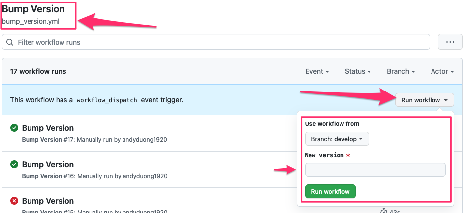

1. Set the `HEX_API_KEY` as a Github secret (skip this step if it has been done).

2. Visit the [Bump Version Github Action Workflow](https://github.com/nimblehq/elixir-templates/actions/workflows/bump_version.yml).

3. Choose `develop` branch.

4. Trigger the workflow with the next `<version number>`. That workflow will create a PR into the `develop` branch with the title `[Chore] Bump version to <version number>`.

5. Merge the Bump version PR above into the `develop` branch.

6. Create the `release/<version number>` from the `develop` branch, pointing to the `master` branch.

7. Once the release branch is merged into the `master` branch, Github Action automatically publishes the template to [https://hex.pm/packages/nimble_template](https://hex.pm/packages/nimble_template).
