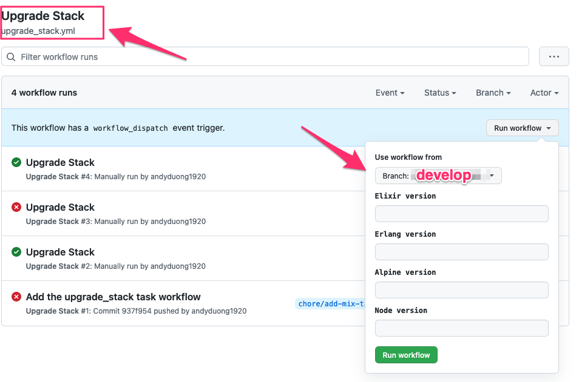

1. Visit the [Upgrade Stack Github Action Workflow](https://github.com/nimblehq/elixir-templates/actions/workflows/upgrade_stack.yml).

2. Choose `develop` branch.

3. Trigger the workflow with the new stack versions. That workflow will create a PR into the `develop` branch with the title `[Chore] Upgrade stack versions`.

4. Merge the PR above into the `develop` branch.
